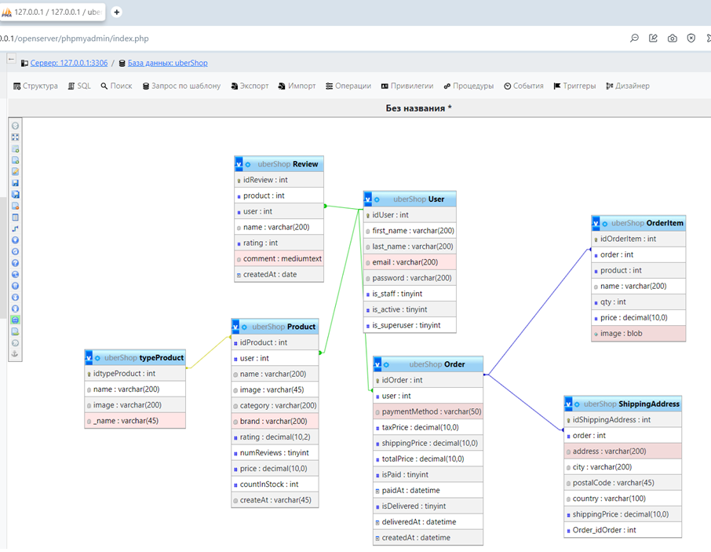
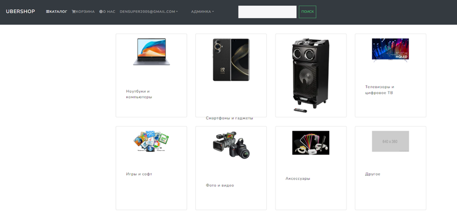
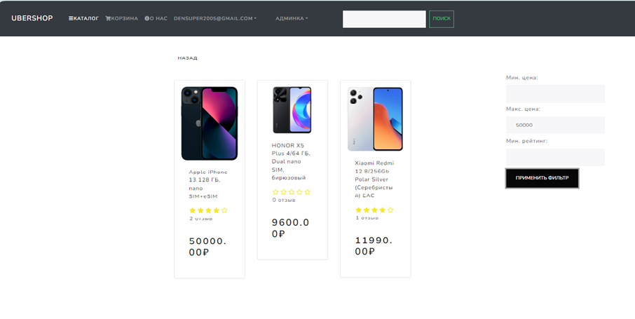
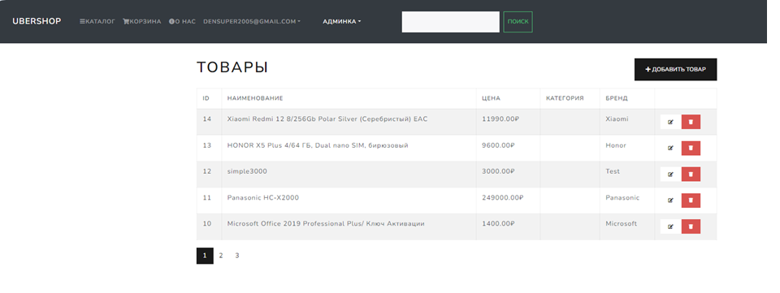
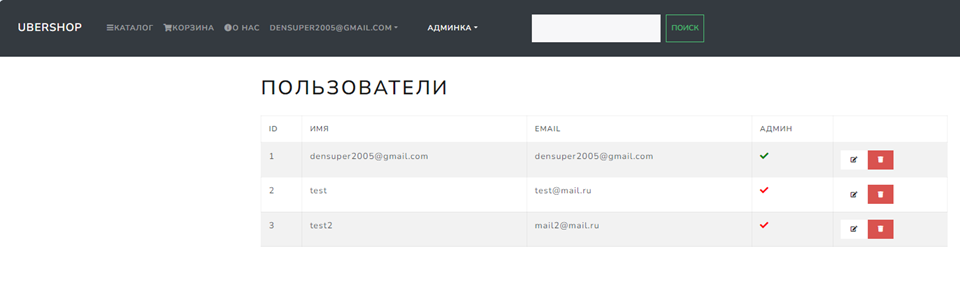
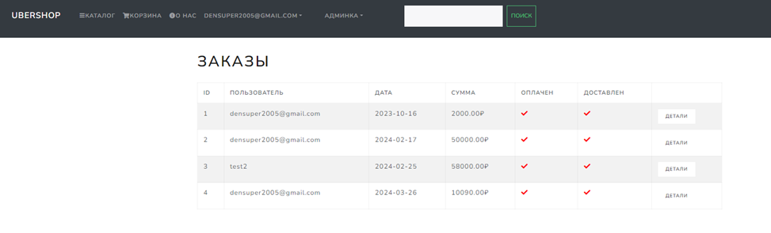

### Практическая работа web
Предметная область «Магазин по продаже электроники». предполагает наличие в информационной системе минимального набора следующих возможностей:
- Хранение информации о товарах доступные для покупки в магазине
- Хранение информации о пользователях, которые хотят купить товар
- Хранение информации о заказах пользователей
- Хранение информации о отзывах на товар

**Стек: Django REST API, JS React, Reduxe, MySQL**

ER-диаграмма БД:

Функции разработанной системы: каталог, личный кабинет пользователя, корзина, админка(добавление и удаление товаров и пользователей), 
оформление заказа, оплата заказа, создание, отзывов.

Здесь представлен каталог товаров, меню с вкладками для дополнительных функций:

Типы товаров, которые продаются в магазине:

В окне товара есть возможность оформить товар, написать отзыв:

Далее представлена работа части, отвечающая за администрирования сайта.

Для правильной работы на локальной машине для Django:
`$env:NODE_OPTIONS = "--openssl-legacy-provider"`
